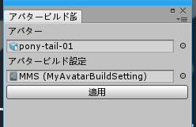
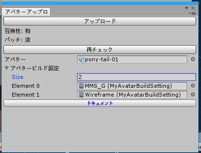
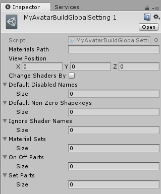
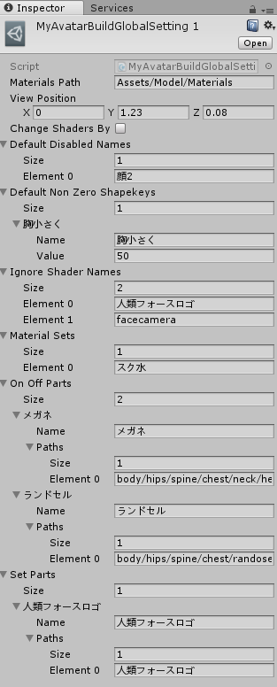
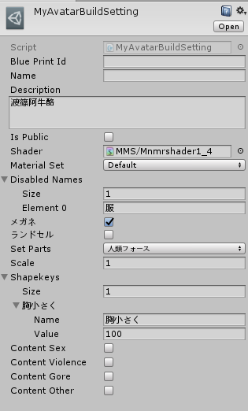

# MyAvatarBuildSetting ドキュメント

VRChat用Unityエディタ拡張「[MyAvatarBuildSetting]()」のドキュメントです。

- [MyAvatarBuildSettingとは](#user-content-myavatarbuildsettingとは)
- [入手方法](#user-content-入手方法)
- [使用方法](#user-content-使用方法)
- [アバタービルド設定ツール](#user-content-アバタービルド設定ツール)
- [アバター一括アップロードツール](#user-content-アバター一括アップロードツール)
- [設定（グローバル）](#user-content-設定グローバル)
- [設定（個別）](#user-content-設定個別)
- [利用規約](#user-content-利用規約)

## MyAvatarBuildSettingとは

**MyAvatarBuildSetting**は、VRChatで単一モデルのアバターを複数の設定で利用することを補助するエディタ拡張です。

- 衣装や装備パーツを変える
- シェイプキーを変える
- シェーダーを使い分ける

等で単一モデルを複数のアバターとしてアップロードするユースケースを想定しています。

**MyAvatarBuildSetting**は、これらを設定で管理して一括変更するツールと、それら設定を適用しつつ順番に複数のアバターを一括アップロードするツールを提供します。

## 入手方法

~~Booth から入手してください。~~（未公開です）

## 使用方法

1. 「[設定（グローバル）](#設定（グローバル）)」のとおりグローバルな設定を行います。
2. 「[設定（個別）](#設定（個別）)」のとおり個別の設定を行います。
3. アバタービルド設定ツールで設定の適用を確認します。
4. アバター一括アップロードツールのパッチを当ててから一括アップロードします。（設定適用後、通常のVRChat SDKでのアップロードも可能です）

## アバタービルド設定ツール



シーン内のアバターとアバター設定を指定して「適用」ボタンを押すと、アバターの各種プロパティがエディタ上で一括変更されます。

Windowメニューから開けます。


## アバター一括アップロードツール



シーン内のアバターと複数のアバター設定を指定して「アップロード」ボタンを押すと、それらの設定を適用したアバターが順次一括アップロードされます。

Windowメニューから開けます。

### パッチを当てる

本ツールはVRChat SDK本体のアップロード完了部分にパッチを当てることで一括アップロードを実現しています。

下記の画面になっている場合パッチ未適用ですので、「パッチ適用」ボタンを押してパッチを当てて下さい。

**注意: このパッチによって、VRChat SDKのアップロード完了時に完了ダイアログボックスが出なくなります。**


### 新規アバターアップロード後のblueprint id更新

新規アバターがアップロードされた場合、その設定のblueprint idを設定側に適用するようにして下さい。

VRChat SDKの「Manage Uploaded Contents」ウインドウから該当するアバターの「Copy Id」を押して、その値を設定のblueprint idの項目に貼り付けて下さい。

## 設定（グローバル）

ツールの前提となるグローバルな設定です。

`Assets/MyAvatarBuildSetting/MyAvatarBuildGlobalSetting.asset`にあります。



### Materials Path （必須）

マテリアルのパスを指定します。（Unityプロジェクトルートフォルダからの相対パス）

例: `Assets/MyModel/Materials`等

#### マテリアル外部化

外部ファイルになっているマテリアルを必要とするので、fbxインポートで予め外部マテリアル形式にしておいてください。


### View Position （必須）

アバターの大きさが1倍の状態でのView Position（視点 VRC_Avatar Descriptorコンポーネントで指定する値と同一）です。

アバターの大きさを変更するオプションがあるため、これをベースとして使います。

### Change Shaders By Path

パスベースのシェーダー切り替えモード（デフォルト=OFF）

アニメーションでマテリアルを切り替える等、シーン中に存在しないマテリアルも切り替える必要がある場合ONにします。

### Default Disabled Names

アバターGameObjectの直下にある子GameObjectのうち、常に非アクティブになっているオブジェクト名を列挙します。

例えばLipSync回避用のオブジェクトなどを指定します。

ここに指定されず、かつ個別設定でも無効指定を受けなかった直下の子GameObjectは全てアクティブになります。

### Default Non Zero Shapekeys

アバターGameObjectの直下にある子GameObjectのシェイプキーのうち、デフォルトで0でない値を持つシェイプキー名を指定します。

ここに指定されず、かつ個別設定で非ゼロの設定にされなかったシェイプキーは全て値が0になります。

### Ignore Shader Names

アバターGameObjectの直下にある子GameObjectのうち、シェーダー変更を適用しないオブジェクト名を列挙します。

例えばアバターにのせる告知画像をいつでも`Unlit/Texture`にしたい場合などはここに列挙します。

### Material Sets

部分的にマテリアルを変更したい場合に使います。

ここで指定したマテリアルセットが個別設定で選択可能になります。

**例**

例えば体のテクスチャを変更することで簡易的に水着を着せるというユースケースでは、以下のように体のテクスチャを変更したマテリアルを水着フォルダに作り、この`Material Sets`に「水着」を指定すると、体のマテリアルのみ「水着」フォルダのものに変更されます。

```
MyModel/Materials/
                 |-体.mat
                 |-服.mat
                 |-髪.mat
                 |-水着/
                       |-体.mat
```

### On Off Parts

表示をオンオフで切り替えるタイプのGameObjectのパスを指定します。

例えばメガネをかけたアバターと外したアバターを用意したい場合、`Name`に「メガネ」、Pathsに`Armature/hips/spine/chest/neck/head/megane`等メガネのGameObjectのパス（アバター直下からの相対パス）を指定します。

ここで指定したパーツが個別設定で選択可能になります。

### Set Parts

表示を全体的に切り替えるタイプのGameObjectのパスを指定します。

例えばフォースA（頭に付ける）とフォースB（アバター上に浮かせる）それぞれのロゴを出し分けたいという場合、

- `Name`=「なし」, Paths=なし
- `Name`=「フォースA」, Paths=`Armature/hips/spine/chest/neck/head/フォースA`
- `Name`=「フォースB」, Paths=`フォースB`（アバター直下）

を指定します。

ここで指定したパーツが個別設定で選択可能になります。

**設定例**



## 設定（個別）

個別の設定です。アセットの「Create」→「アバタービルド設定」で生成できます。



### Blue Print Id（ない場合新規アップロード）

blueprint idを指定します。

新規アバターがアップロードされても自動で更新はされないので、その設定のblueprint idを設定側に適用するようにして下さい。

VRChat SDKの「Manage Uploaded Contents」ウインドウから該当するアバターの「Copy Id」を押して、その値を設定のblueprint idの項目に貼り付けて下さい。

### Name

アバター名です。

省略した場合、設定アセット名が使われます。

### Description

アバターの説明です。

### Is Public

アバターをpublicにする場合はON。

### Shader（必須）

アバターGameObjectの直下にある子GameObjectのシェーダーをこれに変更します。

### Material Set

マテリアルセットの指定です。

### Disabled Names

アバターGameObjectの直下にある子GameObjectのうち非表示にするオブジェクト名を列挙します。

### （グローバル設定のOn Off Partsで指定したもの）

チェックボックスのオンオフで表示を制御できます。

### Set Parts

グローバル設定のSet Partsで指定したものの切り替えが出来ます。

### Shapekeys

変更するシェイプキー名と値を列挙します。

アバターGameObjectの直下にある各子GameObjectの同名シェイプキー値が変更されます。

### Content XXX

アバターアップロード時の指定項目です。適切なものを指定してください。

## 利用規約

- 本ツールの改変は自由です。
- 本ツールの再配布、販売は改変の有無を問わず禁止します
- 本ツールを利用することで発生したトラブルや損失、損害に対して、製作者は一切責任を負いません。本ツールを使用する際は利用者の責任において行ってください。
